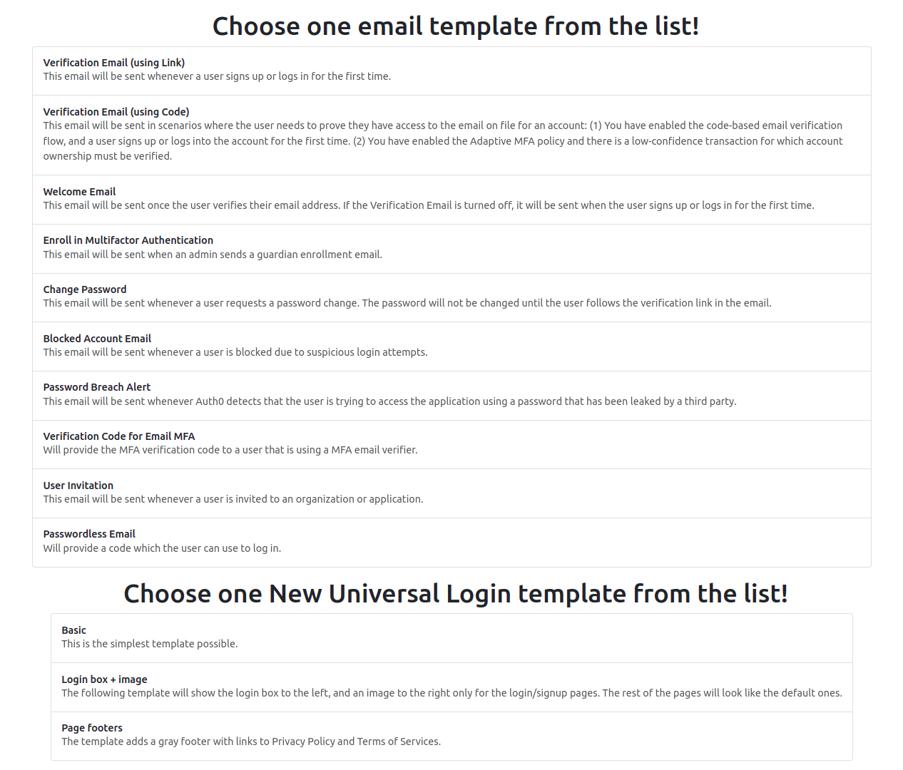
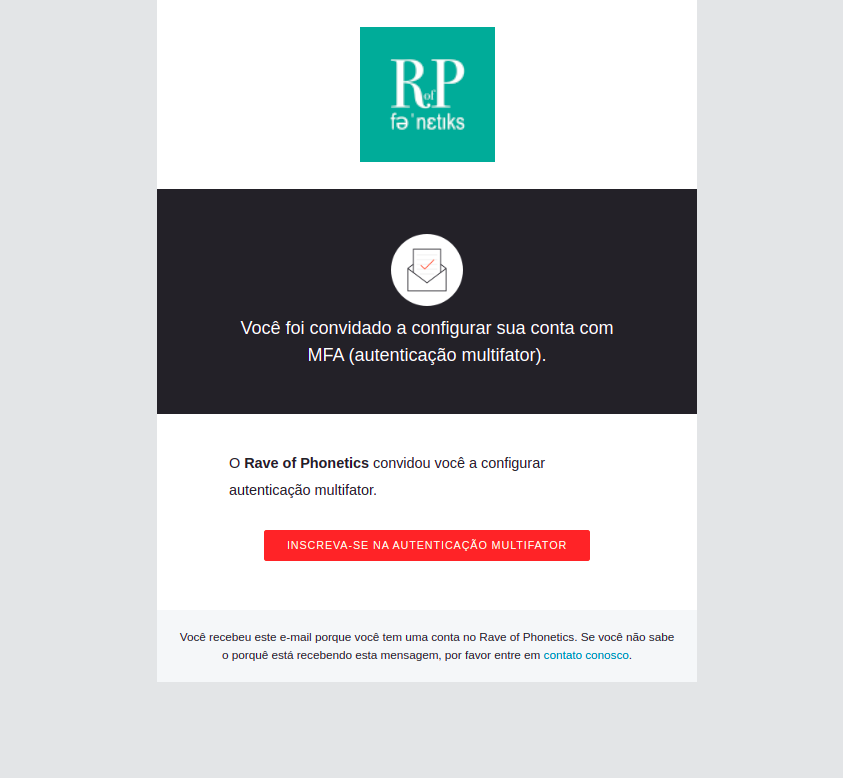

# Auth0 Liquid Tester

Wanna make sure your liquid template is indeed working as expected? Use this project as a playground environment to create your custom templates!

## Project details

Will be available soon! Stay tuned!

In the meantime, know you can start the project with the command:

    docker-compose up

Then you can access the template at `http://localhost:9292/`. Just change the templates and the [auth0_liquid_tester.rb](./lib/auth0_liquid_tester.rb) to match your expected scenario.

This is the home page:

When you click on "Enroll in MFA":

This is the template about the New Universal Login including with footers:

## Useful links

- [Customize New Universal Login Pages](https://auth0.com/docs/customize/universal-login-pages/universal-login-page-templates)
- [Liquid Cheat Sheet](https://www.shopify.com/partners/shopify-cheat-sheet)
