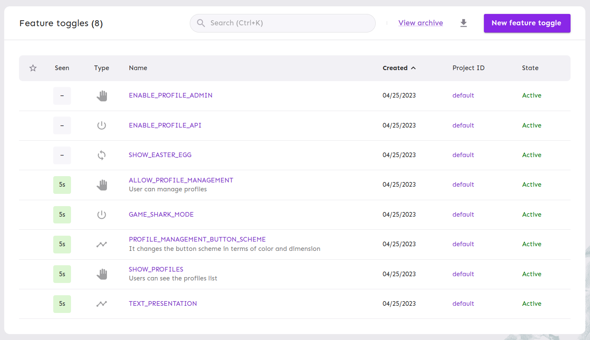

# Feature Toggle Unleash

To understand it, please read the article XYZ.

## Project details

Execute the command:

    docker-compose up

When everything is up, you can access Unleash with the address `http://localhost:4242/` and credential:

```
admin
unleash4all
```

You can access the application at three addresses:

- Home: http://localhost:8000/
- APIs: http://localhost:8000/api/v1/
- Admin: http://localhost:8000/admin/

Use the credential `admin:admin` for the last address.

## Importing the configuration

Access the project's link:

- http://localhost:4242/projects/default

Then click on `Import` icon. It's above the `Event log` tab. Now select the file the JSON file from the iac folder:

- [2023-04-25T19_12_42.110Z-export.json](./iac/2023-04-25T19_12_42.110Z-export.json)

Follow the wizard and finish the importing process. If you access `http://localhost:4242/features` you should see the following image:


