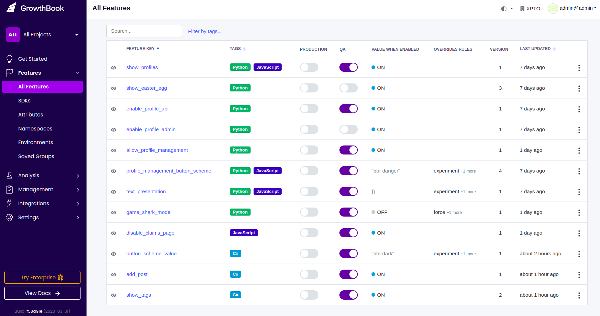

# Feature Toggle GrowthBook

To understand it, please read the article TBD.

## Project details

Execute the command:

    docker-compose up

When everything is up, you can access GrowthBook with the address http://localhost:3000/ and credential:

```
admin@admin
adminadmin
```

You can access the [**Python/Django application**](./app-python-django) at three addresses:

- Home: http://localhost:8000/
- APIs: http://localhost:8000/api/v1/
- Admin: http://localhost:8000/admin/

Use the credential `admin:admin` for the last address.

You can access the [**JavaScript/Next.js application**](./app-javascript-nextjs) from the address:

- http://localhost:3001/

You can access the [**C#/ASP.NET Core with Razor Pages**](./app-csharp-aspnet) from the address:

- http://localhost:5238/

## Exporting the configuration

Let's say your GrowthBook instance is fully configured, then you can access the MongoDB container with `docker-compose exec mongo bash` and execute the following command:

```
cd /tmp && mongodump --authenticationDatabase admin --authenticationMechanism SCRAM-SHA-1 -u root -p password --db test --archive="growthbook-mongodump"
```

Copy the dump from the container to your local machine using the docker cp command. Run this command outside the container:

```
docker cp <container_name>:/tmp/growthbook-mongodump ./
```

Now you are able to use `mongorestore`.

## Importing the configuration

Execute the command:

    docker-compose up mongo

Copy the dump file to the container:

    docker cp ./mongodb-dump/growthbook-mongodump <container_name>:/tmp

Access its container:

    docker-compose exec mongo bash

Given you have the dump file, then you can issue:

    mongorestore --authenticationDatabase admin --authenticationMechanism SCRAM-SHA-1 -u root -p password --db test --archive="/tmp/growthbook-mongodump"

If you open [GrowthBook UI](http://localhost:3000/features), you should see the following toggles:


