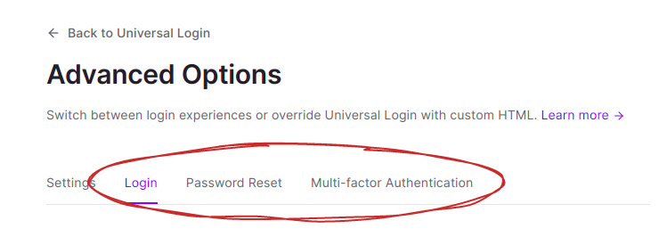

# Universal Login

This page represents a fully customized universal login experience. It uses the library `auth0-js` to accomplish various aspects of identity provider flows.

## FAQ

1. **Why does this project have only two pages?**

It's very important understand the Auth0 platform, because that's why I configured only two pages. Actually, when you customized all login experiences available, you have to configure also the MFA page, but that's optional.

2. **Login does not only allow sign-in, but it also allows sign-up. Is that correct?**

Yes, it is. The login page deals with three flows:

- Sign-in.
- Sign-up.
- Initial reset password.

The `initial reset password` flow I mentioned is completed with the `passwordreset.js` page.
